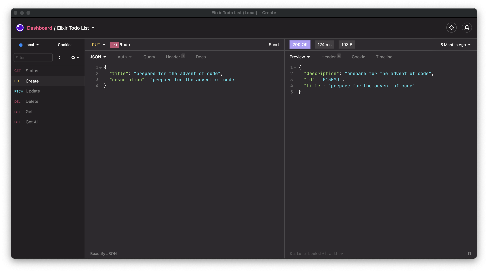

<h3 align="center">Monokai Theme for Insomnia</h3>

    Monokai theme plugin for <a href="https://insomnia.rest">Insomnia</a>.

## Installation

Install the `insomnia-plugin-monokai-theme` plugin from Preferences > Plugins.